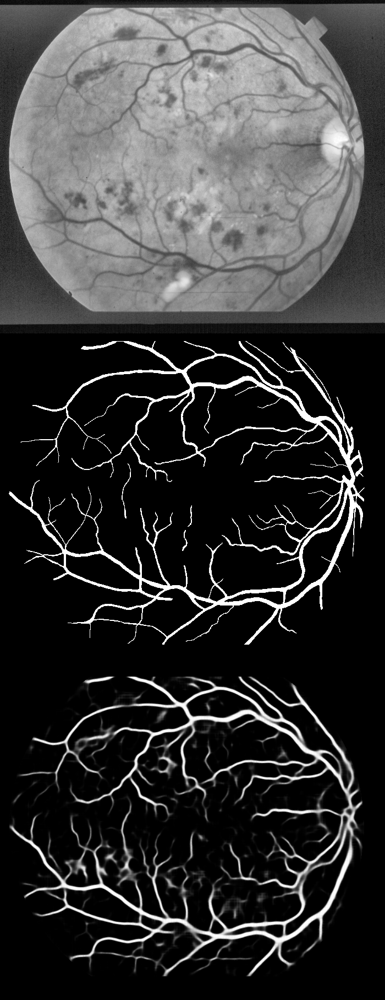
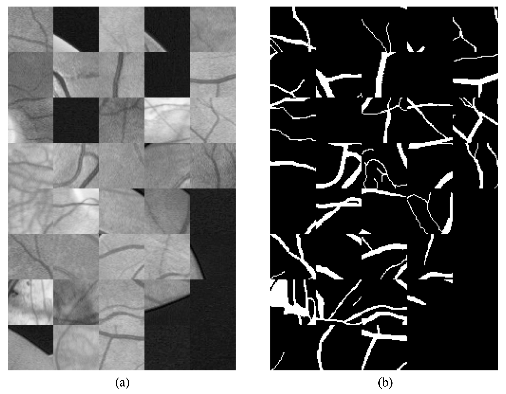
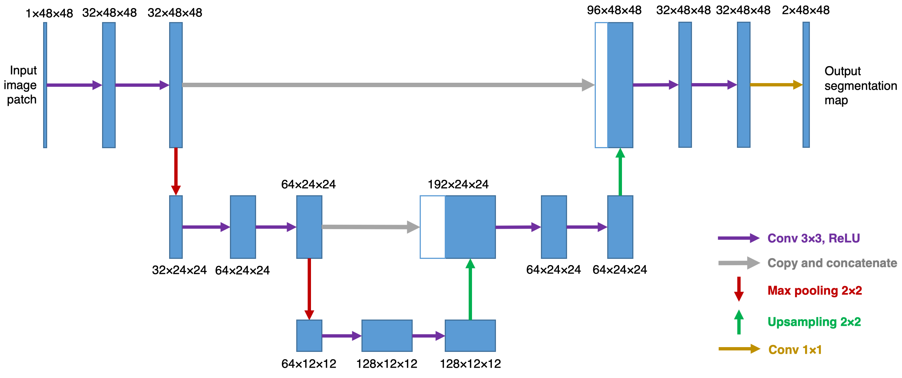
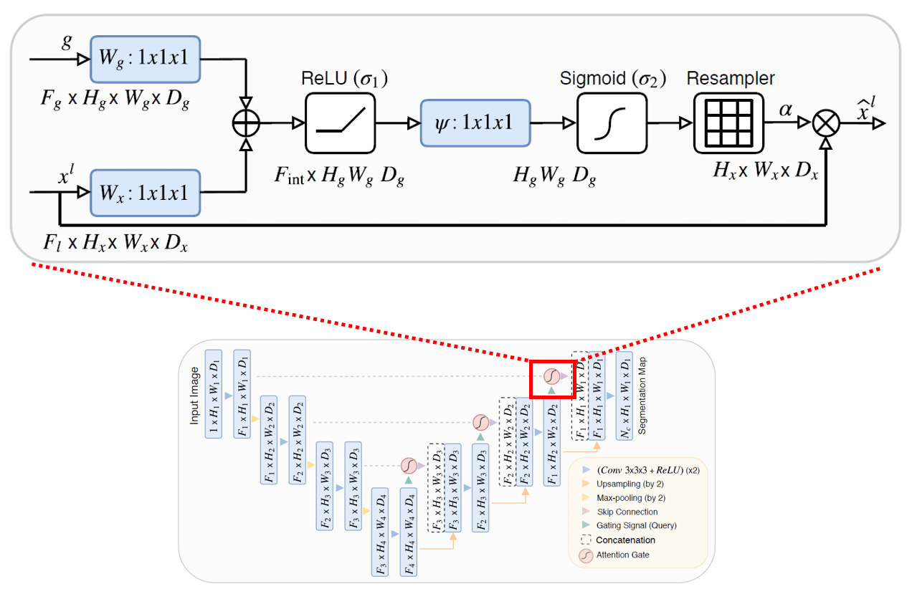

# Retinal Vessel Segmentation using R2U-Net and Attention R2U-Net 

The morphological attributes of retinal vessels, such as length, width, tortuosity and branching pattern and angles, play an important role in diagnosis, screening, treatment, and evaluation of various cardiovascular and ophthalmologic diseases such as diabetes, hypertension and arteriosclerosis. The crucial step before extracting these morphological characteristics of retinal vessels from retinal fundus images is vessel segmentation. In this work, we propose a method for retinal vessel segmentation based on fully convolutional networks. Thousands of patches are extracted from each retinal image and then fed into the network, and data argumentation is applied by rotating extracted patches. Two architectures of fully convolutional networks, R2U-Net and AttR2U-Net, are used for vessel segmentation.


Results on Stare dataset:

<p align="center">

</p>

## Table of Contents
  * [Method](#method)
  * [Network Architectures](#network-architectures)
  * [Results](#results)
  * [Setup](#setup)
  * [Todos](#todos)
  * [Acknowledgements](#acknowledgements)
  * [Citation](#citation)
  * [Connect with me](#connect-with-me)
  * [Bibliography](#bibliography)

## Method
### Preprocessing
* Gray-scale conversion
* Standardization
* Contrast-limited adaptive histogram equalization (CLAHE)
* Gamma adjustment

### Patch Extraction and Data Augmentation
During training, 2000 patches with size 48 × 48 are randomly extracted from each image. Besides patch extraction, each extracted patch was rotated by 90◦, 180◦ and 270◦, thus the training set is quadrupled, i.e. 8000 patches are extracted from each image after data augmentation. At the end, all the patches, including original extracted and generated by rotation, are randomly shuffled and then fed into the network together with their corresponding ground truth segmentation mask patches. 

<p align="center">

</p>

During testing, images are cut into patches with size 48 × 48 and fed into the network for inference. The images are cut into patches by using a stride of N pixels (e.g. N = 5 or 10) in both height and width, so that one pixel can be predicted for multiply times. The final inference result is obtained by averaging multiple predictions.

## Network Architectures
#### U-Net 

<p align="center">

</p>

#### R2U-Net

<p align="center">

</p>

#### Attention U-Net

<p align="center">

</p>

#### Attention R2U-Net

<p align="center">

</p>

## Results
### Results on DRIVE
Table 1: Segmentation results of different deep learning based methods on DRIVE. Bold values show the best score among all methods.

| Method                   | F1         | Sn         | Sp         | Acc        | AUC        |
| ------------------------ |:----------:|:----------:|:----------:|:----------:|:----------:|
| Fu et al [1]             | -          | 0.7603     | -          | 0.9523     | -          |
| Oliveira et al. [2]      | -          | **0.8039** | 0.9804     | 0.9576     | **0.9821** |
| M2U-Net  [3]             | 0.8091     | -          | -          | **0.9630** | 0.9714     |
| **U-Net**     | 0.8169     | 0.7728     | **0.9826** | 0.9559     | 0.9794     |
| **R2U-Net** [4] | **0.8171** | 0.7792     | 0.9813     | 0.9556     | 0.9784     |

### Results on STARE
Table 2: Segmentation results of different deep learning based methods on STARE. Bold values show the best score among all methods.

| Method                   | F1         | Sn         | Sp         | Acc        | AUC        |
| ------------------------ |:----------:|:----------:|:----------:|:----------:|:----------:|
| Fu et al [1]             | -          | 0.7412     | -          | 0.9585     | -          |
| Oliveira et al. [2]      | -          | **0.8315** | 0.9858     | 0.9694     | 0.9905     |
| **R2U-Net** [4]              | **0.8475** | 0.8298     | 0.9862     | **0.9712** | **0.9914** |
| **U-Net**     | 0.8219     | 0.7739     | **0.9867** | 0.9638     | 0.9846     |
| **My Results** | 0.7872     | 0.7783     | 0.97508     | 0.9532    | 0.9728   |


## Setup
So we talked about what retinal vessel segmentation is and what architectures can be used for this task. <br/>
Let's get this thing running!  Follow the next steps:

`git clone https://github.com/abideenml/Detecting-SocialEngineering-Attacks`

Navigate into project directory `cd path_to_repo`

Create a new venv environment and run `pip install -r requirements.txt`

### Requirements
* numpy >= 1.24.3
* PIL -=10.0.0
* opencv ==4.8.0.76
* h5py ==3.9.0
* scikit-learn == 1.3.0
* tensorflow ==2.13.0

### Download and Prepare the Dataset

Download the Stare dataset from `https://cecas.clemson.edu/~ahoover/stare/` and place it in a new folder `STARE`.

Run the script `prepare_datasets_STARE.py` to prepare dataset and store in `STARE_datasets_training_testing` hdf5 format.

### Training
Training from scratch:
```
python run_training.py configuration_stare.txt
```


### Inference and Evaluation
```
python run_testing.py configuration_stare.txt
```

That's it!


## Todos:

Finally there are a couple more todos which I'll hopefully add really soon:
* Effectively calculate the dimensions of segmented retinal vessels for heart disease detection.
* Benchmark the results of Attention R2UNET.


## Acknowledgements

I found these resources useful (while developing this one):

* [Retinal Vessel Segmentation on Papers with code](https://paperswithcode.com/task/retinal-vessel-segmentation)
* [Keras UNET implementation](https://github.com/lixiaolei1982/Keras-Implementation-of-U-Net-R2U-Net-Attention-U-Net-Attention-R2U-Net.-)


## Citation

If you find this code useful, please cite the following:

```
@misc{Zain2023RetinalVesselSegmentation,
  author = {Zain, Abideen},
  title = {retinal-vessel-segmentation},
  year = {2023},
  publisher = {GitHub},
  journal = {GitHub repository},
  howpublished = {\url{https://github.com/abideenml/RetinalVesselSegmentation}},
}
```

## Connect with me

If you'd love to have some more AI-related content in your life :nerd_face:, consider:

* Connect and reach me on [LinkedIn](https://www.linkedin.com/in/zaiinulabideen/) and [Twitter](https://twitter.com/zaynismm)
* Follow me on 📚 [Medium](https://medium.com/@zaiinn440)
* Subscribe to my 📢 weekly [AI newsletter](https://rethinkai.substack.com/)!

## Licence

[](https://github.com/abideenml/RetinalVesselSegmentation/blob/master/LICENCE)


## Bibliography
[1] Fu, H., Xu, Y., Lin, S., Wong, D. W. K., & Liu, J. (2016, October). Deepvessel: Retinal vessel segmentation via deep learning and conditional random field. In International Conference on Medical Image Computing and Computer-Assisted Intervention (pp. 132- 139). Springer, Cham.

[2] Oliveira, A. F. M., Pereira, S. R. M., & Silva, C. A. B. (2018). Retinal Vessel Segmenta- tion based on Fully Convolutional Neural Networks. Expert Systems with Applications.

[3] Laibacher, T., Weyde, T., & Jalali, S. (2018). M2U-Net: Effective and Efficient Retinal Vessel Segmentation for Resource-Constrained Environments. arXiv preprint arXiv:1811.07738.

[4] Alom, M. Z., Hasan, M., Yakopcic, C., Taha, T. M., & Asari, V. K. (2018). Recurrent Residual Convolutional Neural Network based on U-Net (R2U-Net) for Medical Image Segmentation. arXiv preprint arXiv:1802.06955.


